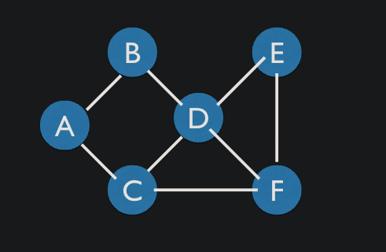

# Graphs
This is a multi-stage project to implement a basic graph class and traversals 

## Part 1: Graph Class
Implement a graph class such that there is a key for each vertices that contain a dictionary mapping vertex labels to edges 
```javaScript
{
    'A': ['B', 'C'],
    'B': ['A', 'D'],
    'C': ['A', 'D', 'F'],
    'D': ['B', 'C', 'E', 'F'],
    'E': ['D', 'F'],
    'F': ['C', 'D', 'E'],
}
```
This represents the graph: 



Create `addVertex` and `addEdge` methods that add the specified entities to the graph. Create `getNeighbors` method to return the neighbors (edges) for a particular vertex

To create the above graph we can run the following:
```js
const graph = new Graph() // instantiate the graph
graph.addVertex('A')
graph.addVertex('B')
graph.addVertex('C')
graph.addVertex('D')
graph.addVertex('E')
graph.addVertex('F')

graph.addEdge("A", "B");
graph.addEdge("A", "C");
graph.addEdge("B", "A");
graph.addEdge("B", "D");
graph.addEdge("C", "A");
graph.addEdge("C", "D");
graph.addEdge("C", "F");
graph.addEdge("D", "B");
graph.addEdge("D", "C");
graph.addEdge("D", "E");
graph.addEdge("D", "F");
graph.addEdge("E", "D");
graph.addEdge("E", "F");
graph.addEdge("F", "C");
graph.addEdge("F", "D");
graph.addEdge("F", "E");
```

## Part 2 Implement Breadth-First Traversal 
Function that takes a starting node as the argument and performs the breadth-first traversal. The function will print out the resulting nodes in the order they were visited (Note there are multiple valid paths that may be printed)

Algorithm: 
1. Add a vertex from the graph to a queue of vertices to be seen and mark it as seen
2. Visit the vertex in the front of the queue
3. If that vertex has any neighbors, check to see if they have been seen and mark them
4. Add any neighboring vertices that still need to be seen to the back of the queue
5. Process the vertex at the front of the queue
6. Repeat 2-5 until we’ve exhausted the list of vertices 


## Part 3 Implement Depth-First Traversal
Function that takes a starting node as the argument and performs the depth-first traversal. The function will print out the resulting nodes in the order they were visited (Note there are multiple valid paths that may be printed)

Algorithm:
1. Add a vertex from the graph to the top of the stack
2. Mark that vertex as visited
3. Pop vertex off the top of the stack
4. Check if that vertex has any neighbors
5. If those neighbors have not been visited, push them onto the stack
6. Process what’s on top of the stack
7. Repeat steps 3-6 until exhausted all vertices